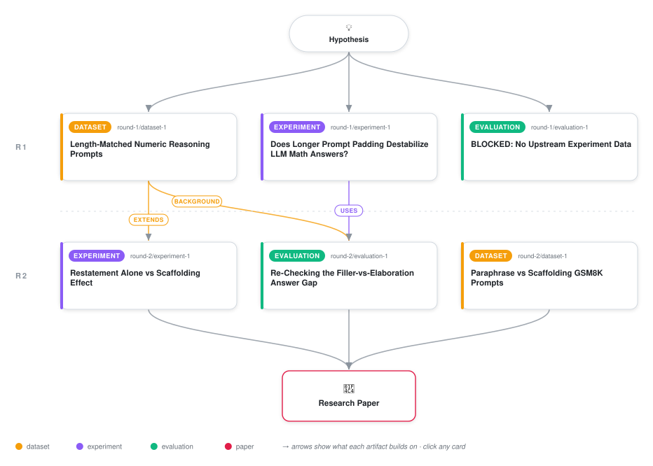

# Interpretive Load, Not Token Count, Drives LLM Answer Instability

<div align="center">

<a href="https://cdn.jsdelivr.net/gh/ai-inventor-outputs/ai-invention-0e9809-interpretive-load-not-token-count-drives@main/workflow.svg">
<picture>
  <source media="(prefers-color-scheme: dark)" srcset="workflow-dark.svg">
  
</picture>
</a>

<sub>🖱️ <b><a href="https://cdn.jsdelivr.net/gh/ai-inventor-outputs/ai-invention-0e9809-interpretive-load-not-token-count-drives@main/workflow.svg">Open the interactive diagram</a></b> — every card links to its artifact folder.</sub>

</div>

> **TL;DR** — A length-and-content-matched GSM8K prompt battery, sampled across three same-provider GPT models (5,589 completions), shows that irrelevant filler leaves numeric-answer variance and a logprob-entropy proxy near the bare-question baseline even at ~650 extra tokens, while relevant elaboration destabilizes both -- but this iteration adds seed-clustered bootstrap confidence intervals (pooled gap +0.195, CI [0.091,0.319]), downgrades an earlier fragile condition-mean entropy-CV correlation (r=0.75, n=7) to a defensible cell-level one (r=0.284, n=332, CI-excluding-zero), and a follow-up decomposition experiment shows the destabilizing effect concentrates in redundant question restatement (+0.103 CV) rather than generic verification scaffolding (-0.101 CV), connecting the finding to the prompt-paraphrase-sensitivity literature.

<details>
<summary>Full hypothesis</summary>

Longer prompts do not destabilize LLM numeric answers via content-agnostic attention dilution over the growing token count. Instead, destabilization is content-specific and, more narrowly than previously framed, concentrated in redundant restatement of the question itself: irrelevant filler content, even at ~650 extra tokens, leaves both answer coefficient-of-variation (CV) and a logprob-entropy proxy close to a bare-question baseline (statistically supported via seed-clustered bootstrap: pooled elaboration-minus-filler CV gap +0.195, 95% CI [0.091, 0.319], Wilcoxon p=3.7e-4, n=16 seeds; individually CI-excluding-zero at the medium tier only, with short/long tiers directionally consistent but not individually significant at this seed count), while token-matched relevant elaboration elevates both substantially and non-monotonically across length tiers. A follow-up decomposition (8 fresh seeds, self-constructed, not yet re-analyzed with the same bootstrap rigor applied elsewhere) suggests this elevation is driven specifically by redundant paraphrase/restatement of the question rather than by generic verification scaffolding (+0.103 vs -0.101 raw CV deltas), but these point estimates lack confidence intervals and significance tests and must be treated as suggestive pending that re-analysis; the same 8-seed run's bare-control baseline (CV=0.195, frac_correct=0.819) differs non-trivially from the original 16-seed baseline (CV=0.170, frac_correct=0.906), so absolute levels across the two experiments are not directly comparable and only within-experiment deltas should be read as such. A logprob-entropy proxy correlates with CV at the individual (prompt,model) cell level (r=0.284/0.260, both seed-cluster CI-excluding-zero, n=332) but at a much smaller effect size than an earlier condition-mean estimate (r=0.75/0.59) suggested, and no formal mediation analysis has been run on any dataset in this project. We revise the mechanism to a competing-interpretation/redundant-restatement account: instability tracks how much the added text semantically duplicates or conflicts with the question's own stated constraints, not raw token count and not task-relevant content in general (scaffolding language alone does not reproduce the effect). This finding is scoped to a single numeric-reasoning domain (GSM8K arithmetic) and three same-provider, same-family closed models (gpt-4o-mini, gpt-4.1-mini, gpt-4.1-nano), so it should not yet be generalized to RAG/agentic/legal-document pipelines, cross-provider model families, or non-numeric tasks without further testing.

</details>

[](https://cdn.jsdelivr.net/gh/ai-inventor-outputs/ai-invention-0e9809-interpretive-load-not-token-count-drives@main/paper.pdf) [](https://github.com/ai-inventor-outputs/ai-invention-0e9809-interpretive-load-not-token-count-drives/tree/main/paper_latex)

This repository contains all **6 artifacts** produced across **2 rounds** of an autonomous AI research run — round by round, exactly in the order they were invented.

## Round 1

| Artifact | Type | Demo | Source | Builds on |
|----------|------|------|--------|-----------|
| **[Length-Matched Numeric Reasoning Prompts](https://github.com/ai-inventor-outputs/ai-invention-0e9809-interpretive-load-not-token-count-drives/tree/main/round-1/dataset-1)** | [](https://github.com/ai-inventor-outputs/ai-invention-0e9809-interpretive-load-not-token-count-drives/tree/main/round-1/dataset-1) | [](https://colab.research.google.com/github/ai-inventor-outputs/ai-invention-0e9809-interpretive-load-not-token-count-drives/blob/main/round-1/dataset-1/demo/data_code_demo.ipynb) | [](https://github.com/ai-inventor-outputs/ai-invention-0e9809-interpretive-load-not-token-count-drives/tree/main/round-1/dataset-1/src) | — |
| **[Does Longer Prompt Padding Destabilize LLM Math Answers?](https://github.com/ai-inventor-outputs/ai-invention-0e9809-interpretive-load-not-token-count-drives/tree/main/round-1/experiment-1)** | [](https://github.com/ai-inventor-outputs/ai-invention-0e9809-interpretive-load-not-token-count-drives/tree/main/round-1/experiment-1) | [](https://colab.research.google.com/github/ai-inventor-outputs/ai-invention-0e9809-interpretive-load-not-token-count-drives/blob/main/round-1/experiment-1/demo/method_code_demo.ipynb) | [](https://github.com/ai-inventor-outputs/ai-invention-0e9809-interpretive-load-not-token-count-drives/tree/main/round-1/experiment-1/src) | — |
| **[BLOCKED: No Upstream Experiment Data](https://github.com/ai-inventor-outputs/ai-invention-0e9809-interpretive-load-not-token-count-drives/tree/main/round-1/evaluation-1)** | [](https://github.com/ai-inventor-outputs/ai-invention-0e9809-interpretive-load-not-token-count-drives/tree/main/round-1/evaluation-1) | [](https://colab.research.google.com/github/ai-inventor-outputs/ai-invention-0e9809-interpretive-load-not-token-count-drives/blob/main/round-1/evaluation-1/demo/eval_code_demo.ipynb) | [](https://github.com/ai-inventor-outputs/ai-invention-0e9809-interpretive-load-not-token-count-drives/tree/main/round-1/evaluation-1/src) | — |

## Round 2

| Artifact | Type | Demo | Source | Builds on |
|----------|------|------|--------|-----------|
| **[Re-Checking the Filler-vs-Elaboration Answer Gap](https://github.com/ai-inventor-outputs/ai-invention-0e9809-interpretive-load-not-token-count-drives/tree/main/round-2/evaluation-1)** | [](https://github.com/ai-inventor-outputs/ai-invention-0e9809-interpretive-load-not-token-count-drives/tree/main/round-2/evaluation-1) | [](https://colab.research.google.com/github/ai-inventor-outputs/ai-invention-0e9809-interpretive-load-not-token-count-drives/blob/main/round-2/evaluation-1/demo/eval_code_demo.ipynb) | [](https://github.com/ai-inventor-outputs/ai-invention-0e9809-interpretive-load-not-token-count-drives/tree/main/round-2/evaluation-1/src) | <sub><i>uses:</i><br/>[experiment‑1&nbsp;(R1)](https://github.com/ai-inventor-outputs/ai-invention-0e9809-interpretive-load-not-token-count-drives/tree/main/round-1/experiment-1)<br/><i>background:</i><br/>[dataset‑1&nbsp;(R1)](https://github.com/ai-inventor-outputs/ai-invention-0e9809-interpretive-load-not-token-count-drives/tree/main/round-1/dataset-1)</sub> |
| **[Paraphrase vs Scaffolding GSM8K Prompts](https://github.com/ai-inventor-outputs/ai-invention-0e9809-interpretive-load-not-token-count-drives/tree/main/round-2/dataset-1)** | [](https://github.com/ai-inventor-outputs/ai-invention-0e9809-interpretive-load-not-token-count-drives/tree/main/round-2/dataset-1) | [](https://colab.research.google.com/github/ai-inventor-outputs/ai-invention-0e9809-interpretive-load-not-token-count-drives/blob/main/round-2/dataset-1/demo/data_code_demo.ipynb) | [](https://github.com/ai-inventor-outputs/ai-invention-0e9809-interpretive-load-not-token-count-drives/tree/main/round-2/dataset-1/src) | — |
| **[Restatement Alone vs Scaffolding Effect](https://github.com/ai-inventor-outputs/ai-invention-0e9809-interpretive-load-not-token-count-drives/tree/main/round-2/experiment-1)** | [](https://github.com/ai-inventor-outputs/ai-invention-0e9809-interpretive-load-not-token-count-drives/tree/main/round-2/experiment-1) | [](https://colab.research.google.com/github/ai-inventor-outputs/ai-invention-0e9809-interpretive-load-not-token-count-drives/blob/main/round-2/experiment-1/demo/method_code_demo.ipynb) | [](https://github.com/ai-inventor-outputs/ai-invention-0e9809-interpretive-load-not-token-count-drives/tree/main/round-2/experiment-1/src) | <sub><i>extends:</i><br/>[dataset‑1&nbsp;(R1)](https://github.com/ai-inventor-outputs/ai-invention-0e9809-interpretive-load-not-token-count-drives/tree/main/round-1/dataset-1)</sub> |

## Repository Structure

Artifacts are grouped by the round of invention that produced them. Each
artifact has its own folder with source code and a self-contained demo:

```
.
├── round-1/                         # One folder per round of invention
│   ├── experiment-1/
│   │   ├── README.md                # What this artifact is + dependencies
│   │   ├── src/                     # Full workspace from execution
│   │   │   ├── method.py            # Main implementation
│   │   │   ├── method_out.json      # Full output data
│   │   │   └── ...                  # All execution artifacts
│   │   └── demo/                    # Self-contained demo
│   │       └── method_code_demo.ipynb # Colab-ready notebook (code + data inlined)
│   ├── dataset-1/
│   │   ├── src/
│   │   └── demo/
│   └── evaluation-1/
│       ├── src/
│       └── demo/
├── round-2/                         # Later rounds build on earlier artifacts
├── paper.pdf                        # Research paper
├── paper_latex/                     # LaTeX source files
├── workflow.svg                     # Artifact dependency diagram (this page's header)
└── README.md
```

## Running Notebooks

### Option 1: Google Colab (Recommended)

Click the "Open in Colab" badges above to run notebooks directly in your browser.
No installation required!

### Option 2: Local Jupyter

```bash
# Clone the repo
git clone https://github.com/ai-inventor-outputs/ai-invention-0e9809-interpretive-load-not-token-count-drives
cd ai-invention-0e9809-interpretive-load-not-token-count-drives

# Install dependencies
pip install jupyter

# Run any artifact's demo notebook
jupyter notebook <artifact_folder>/demo/
```

## Source Code

The original source files are in each artifact's `src/` folder.
These files may have external dependencies - use the demo notebooks for a self-contained experience.

---
*Generated by AI Inventor Pipeline - Automated Research Generation*
